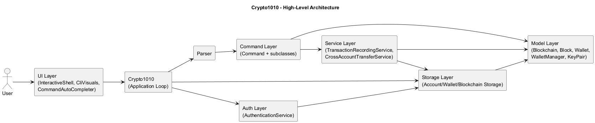
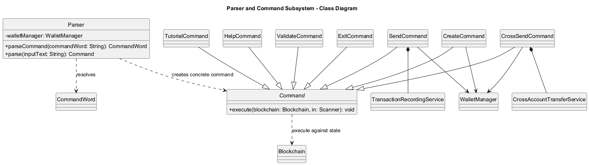
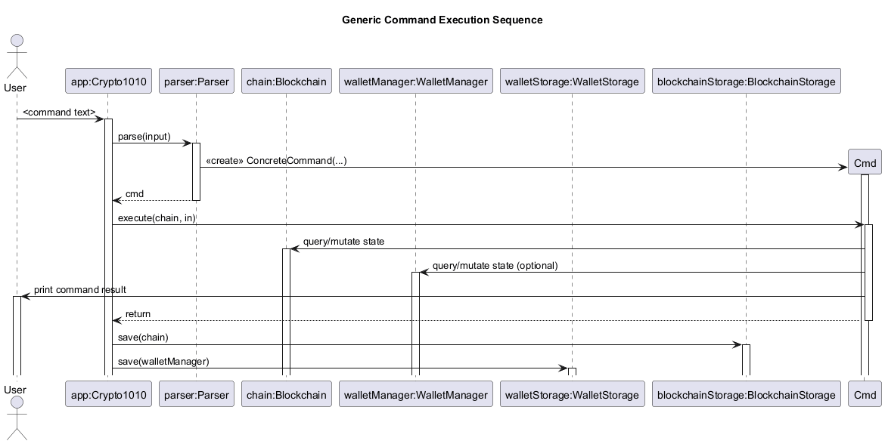
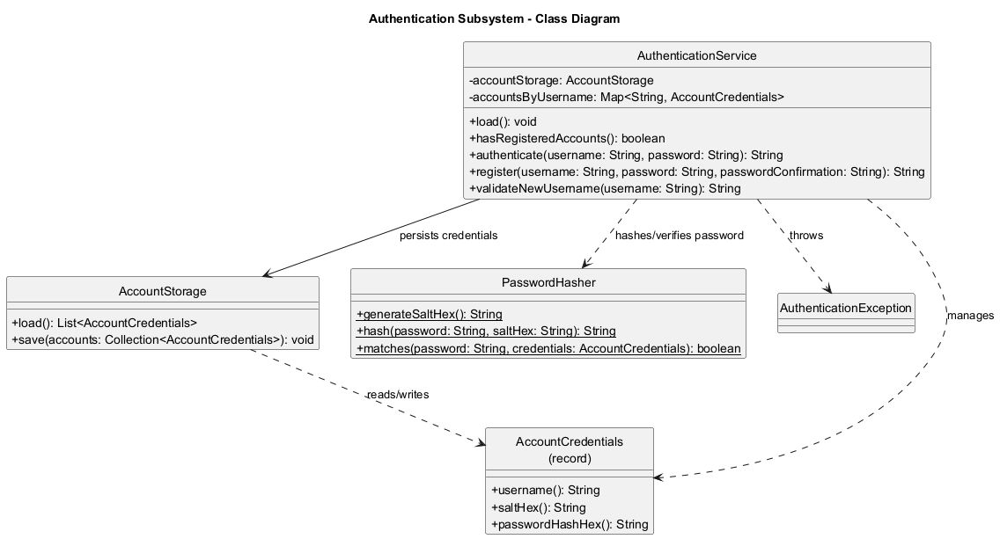
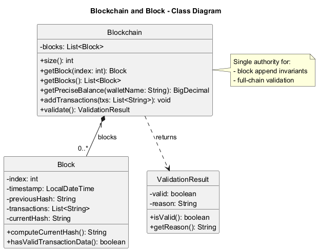
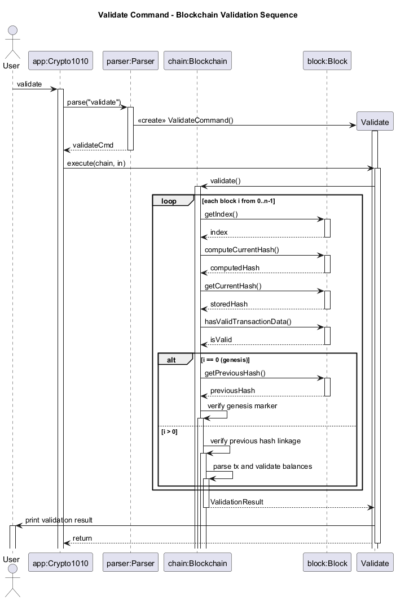
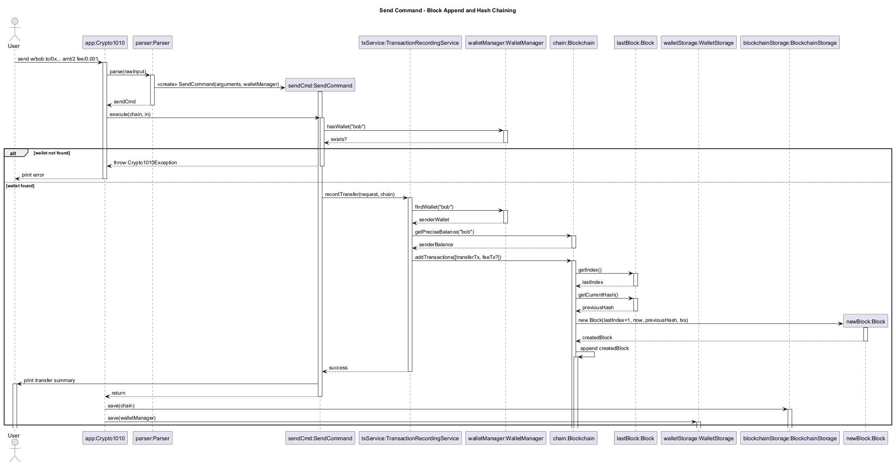
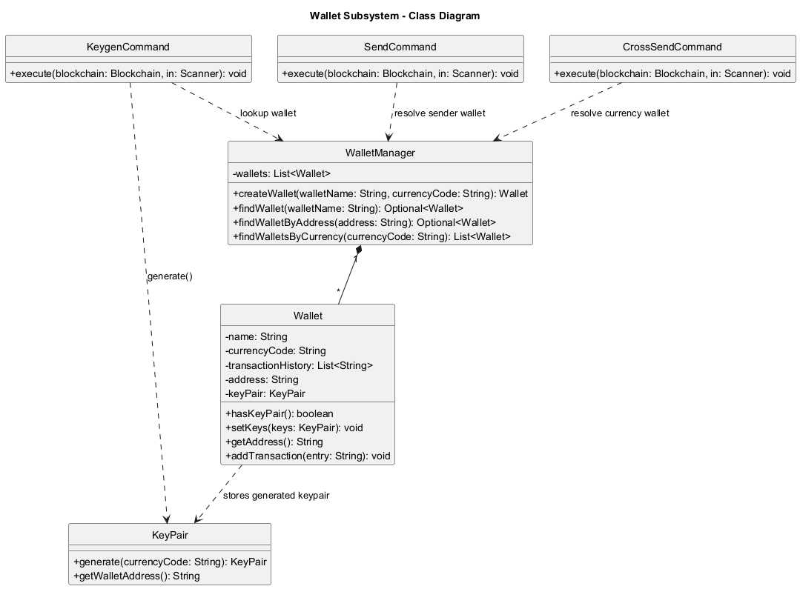
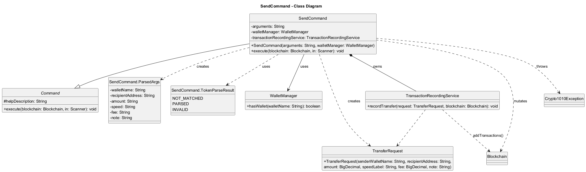
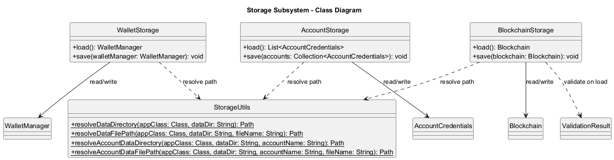

# Crypto1010 Developer Guide

## Acknowledgements
- Java Platform, Standard Edition 17 API documentation: https://docs.oracle.com/en/java/javase/17/docs/api/
- JUnit 5 User Guide (for unit testing approach and assertions): https://junit.org/junit5/docs/current/user-guide/
- Gradle User Manual (build and task orchestration): https://docs.gradle.org/current/userguide/userguide.html
- Password hashing: Java Cryptography Architecture (`PBKDF2WithHmacSHA256`) from the Java standard library.
- Address hashing: Bouncy Castle digest implementations (`KeccakDigest`, `RIPEMD160Digest`).

## Design & Implementation
Crypto1010 is implemented as a modular command-line application with clear separation between authentication, input parsing, command execution, domain model, and persistence.

### Architecture overview
- `Crypto1010` manages the main loop, input capture, authentication handoff, and save/load lifecycle.
- `auth` package handles account registration, login, and password hashing.
- `Parser` maps raw user input to concrete command objects.
- `command` package implements user-facing functionality (`create`, `send`, `crossSend`, `balance`, `logout`, etc.).
- `service` package centralizes transaction logic shared across commands.
- `model` package contains core blockchain and wallet state plus invariants.
- `storage` package persists account credentials and account-scoped blockchain/wallet data.
- `ui` package manages CLI rendering (`CliVisuals`) and interactive input (`InteractiveShell`, `CommandAutoCompleter`).

### Parser and command subsystem
#### Structural view (class diagram)
The class diagram below introduces parser-to-command construction and core command hierarchy before runtime interactions.

### Command execution flow
The following sequence diagram shows the standard command path after a user is authenticated:

1. User enters a command string.
2. `Crypto1010` passes the raw input to `Parser`.
3. `Parser` constructs a concrete `Command` object.
4. `Crypto1010` executes the command with the current in-memory `Blockchain` and `WalletManager`.
5. On success, `Crypto1010` persists both blockchain and wallet states when save is enabled for that session.
6. If a save operation fails, the app exits to avoid continuing with potentially inconsistent persistence state.

### Authentication subsystem
#### Structural view (class diagram)
The class diagram below introduces account credential management and password hashing structure used during login/registration.

Key authentication behavior:
- Password storage uses per-account random salt + PBKDF2 (`PBKDF2WithHmacSHA256`) derived hash.
- Username lookup is case-insensitive through normalized lowercase keys.
- Login throttling is in-memory per username: after 5 failed attempts, login for that username is blocked for 30 seconds.
- Credential files support an HMAC signature header; when present, signed content is verified during load.

### CLI shell, prompt, and tab completion
- `InteractiveShell` wraps JLine when a non-dumb terminal is available; otherwise it falls back to scanner input.
- `Crypto1010` uses a shared shell and a mode-aware `CommandAutoCompleter` across the full app lifecycle.
- Completion scopes are switched explicitly:
  - pre-login (auth mode): `1`, `2`, `3`, `login`, `register`, `exit`
  - post-login (command mode): command words plus context-aware prefix/value suggestions
  - post-logout: returns to pre-login scope
- Prompt format in authenticated sessions is `USERNAME@crypto1010 ~`.

Design rationale:
- A single shell/completer instance avoids terminal reinitialization issues that can break completion after login.
- Explicit mode switching prevents suggestion leakage between authentication and command execution contexts.

### Adding a new command
1. Add the new keyword and description to `CommandWord` so it appears in `help`.
2. Implement a new `Command` subclass in the `command` package.
3. Update `Parser.parse(...)` to construct the new command.
4. Add focused JUnit tests under `src/test/java/seedu/crypto1010/command`.
5. Add a manual test case in this guide.

### Blockchain and Block subsystem
This section documents the enhancement: the blockchain core (`Blockchain`, `Block`) and integrity-first validation flow that powers `validate`, `send`, and persisted-chain loading.

#### Scope of enhancement
- Tamper-evident block representation with deterministic SHA-256 hashing.
- End-to-end chain integrity checks across index, hash linkage, and transaction semantics.
- Transaction-safe balance validation during chain verification.
- Controlled block append path for new transactions.
- Persistence gatekeeping: reject corrupted blockchain files at load time.

#### Architecture-level design
The blockchain subsystem is centered on two model classes:
- `Block`: immutable record of block payload fields and hash computation.
- `Blockchain`: ordered aggregate and the single authority for chain validation and block appending.

`ValidateCommand` delegates all integrity checks to `Blockchain.validate()`; command layer does not duplicate blockchain logic. `BlockchainStorage.load()` also invokes `validate()` after deserialization. This means both interactive validation and startup data loading use the same invariant checks, avoiding drift between runtime and persistence behavior.

At system level, the flow is:
1. Commands mutate/query blockchain through `Blockchain` APIs.
2. `Blockchain` owns block construction and linkage rules.
3. Storage serializes/deserializes raw state.
4. Validation logic gates acceptance of loaded data.

This keeps blockchain rules in one place and reduces the risk of inconsistent behavior between command paths.

#### Structural view (class diagram)
The class diagram below introduces the static structure before runtime interactions.

#### Component-level design
`Block` design choices:
- Block state includes `index`, `timestamp`, `previousHash`, `transactions`, and `currentHash`.
- `computeCurrentHash()` recomputes SHA-256 from the full payload (`index|timestamp|previousHash|joinedTransactions`).
- `hasValidTransactionData()` enforces non-empty, non-blank transaction entries.

Why this design:
- Recompute support enables tamper detection without trusting stored hash values.
- Hashing full payload makes any transaction/link/timestamp modification detectable.
- Lightweight representation stays easy to serialize while still being integrity-aware.

`Blockchain` design choices:
- Internally stores blocks as a mutable list, exposed as unmodifiable view for read access.
- `addTransactions(...)` is the only append path: it always derives `newIndex = last.index + 1` and `previousHash = last.currentHash`.
- `validate()` runs deterministic checks in a fixed order and returns a structured `ValidationResult`.

Validation stages in `Blockchain.validate()`:
1. Structural checks:
   - chain non-empty
   - block index continuity (`block.index == iteration index`)
2. Cryptographic consistency:
   - `block.computeCurrentHash()` equals stored `block.currentHash`
3. Data quality:
   - no blank/null transactions
4. Genesis constraints:
   - previous hash equals fixed genesis predecessor
   - transaction data is exactly `Genesis Block`
5. Linkage checks for non-genesis blocks:
   - `block.previousHash == previousBlock.currentHash`
6. Economic/semantic checks:
   - transaction format must match `sender -> receiver : amount`
   - amount must be positive
   - sender must have sufficient running balance
   - exempt accounts (e.g., `network`, `network-fee`) bypass balance enforcement

#### Balance validation strategy
Validation uses a running `Map<String, BigDecimal>` keyed by normalized account names.
- For each parsed transaction:
  - sender balance is checked/decremented (unless exempt).
  - receiver balance is incremented (unless exempt).
- If any sender lacks funds at that point in chain order, validation fails immediately.

Rationale:
- Enforces causal ordering semantics (a transfer is only valid if funds existed before that transaction).
- Keeps validation deterministic and independent from wallet objects.
- Uses `BigDecimal` to avoid floating-point precision drift.

#### Block append behavior from transfer flow
`SendCommand` delegates to `TransactionRecordingService`, which composes one or two transaction strings (transfer + optional fee) and calls `Blockchain.addTransactions(...)`.

`Blockchain.addTransactions(...)`:
- rejects empty transaction batches.
- obtains the last block.
- builds a new block with current timestamp and last block hash as predecessor.
- computes new block hash at construction.
- appends to chain.

This ensures hash linkage is always created from canonical in-memory state, not externally supplied values.

#### Interaction views (sequence diagrams)
Validation flow:

Append flow during `send`:

#### Persistence interaction
`BlockchainStorage` serializes blocks to JSON and reconstructs them on load.
After parsing JSON into `Block` objects, it calls `validate()`. Invalid chains are rejected with an `IOException`, and app startup falls back to a safe default chain. This prevents partially tampered or malformed persisted state from silently entering runtime.

#### Alternatives considered
1. Recompute balance on demand for each transaction during validation without a running map:
   - Rejected because it is less efficient and harder to reason about for long chains.
2. Put transaction-format validation in command/service only:
   - Rejected because persisted data could bypass command checks; blockchain-level validation must be authoritative.
3. Allow direct block injection (`addBlock(Block)` API):
   - Rejected to reduce misuse risk. `addTransactions(...)` preserves index/hash derivation invariants.
4. Skip validation during storage load for faster startup:
   - Rejected because startup should fail-safe against tampered files.

#### Trade-offs and known limitations
- Chain validation currently scans all blocks each run (`O(n * txPerBlock)`), acceptable for project-scale data but not optimized for large ledgers.
- Hashing uses payload string concatenation; robust for current format but not yet versioned for schema evolution.
- Exempt account model is pragmatic for simulation and fees but not a full consensus/economic model.

#### Planned next-step extension (post-v2.1)
The current implementation validates a complete chain each time. A planned extension is an incremental validation cache:
- store the latest validated block hash and running balances snapshot.
- on append, validate only new blocks against cached state.
- invalidate cache automatically after file import/load mismatch.

Reason for planning this enhancement:
- keeps correctness guarantees while reducing repeated full-chain scans for larger datasets.
- preserves the current fail-safe model because full validation remains available as a fallback path.

### Wallet, WalletManager, and KeyPair subsystem
This section documents wallet identity and lifecycle management through `Wallet`, `WalletManager`, and `KeyPair`.

#### Structural view (class diagram)
The class diagram below introduces core wallet classes before command-level interactions.

#### Scope of enhancement
- secp256k1 keypair generation per wallet (`keygen` command path).
- Currency-aware wallet management to support unambiguous `crossSend curr/...` routing.
- Address-based recipient resolution support for local-address sends.

#### Architectural-level design
The subsystem spans three model classes:
- `KeyPair`: owns generated private/public secp256k1 values and derived wallet address.
- `Wallet`: mutable identity container (name, currency, optional keypair/address, outgoing history).
- `WalletManager`: lifecycle authority for creation and lookup (name/currency/address).

`Wallet` does not generate keys internally. `KeygenCommand` calls `KeyPair.generate(...)` and injects the result via `wallet.setKeys(...)`.

#### Component-level design
`KeyPair` design choices:
- Generates secp256k1 private key and computes public key point via scalar multiplication.
- Verifies generated public key lies on curve before accepting output.
- Derives Ethereum-style addresses via Keccak-256 for `eth`/`generic` currency wallets.
- Derives Bitcoin Base58Check addresses via compressed pubkey + SHA-256 + RIPEMD-160 for `btc`.

`Wallet` design choices:
- Address is null until keys are generated.
- `hasKeyPair()` explicitly exposes keyed/unkeyed state.
- `setKeys(...)` is guarded at command level by `KeygenCommand` (regeneration blocked).
- Currency code is normalized at construction time.

`WalletManager` design choices:
- Enforces unique wallet names (case-insensitive).
- Enforces at most one non-generic wallet per specific currency per account.
- Provides `findWalletByAddress(...)` for local recipient resolution in send flow.

#### Trade-offs and known limitations
- This project generates addresses but does not sign/verify transactions with private keys.
- Keypairs/addresses are persisted in wallet storage and restored on load.
- Crypto model is educational and does not implement full production wallet standards end-to-end.

### Tutorial
This section documents the tutorial enhancement.

#### Component-level design

`TutorialCommand` design choices:
- Encapsulates the full tutorial flow within a single command execution cycle.
- Maintains a step index (`int index`) to track progression through predefined tutorial stages.
- Uses static arrays (`instructions[]`, `steps[]`, `tutorialMessages[]`) to define deterministic tutorial content.
- Operates on a separate blockchain instance (`Blockchain.createDefault()`) to isolate tutorial execution.
- Delegates command interpretation to `Parser` and execution to dynamically resolved `Command` objects.

Why this design:
- Ensures tutorial state is fully self-contained and does not interfere with user-managed blockchain data.
- Enables reproducible step-by-step execution for educational purposes.
- Centralises tutorial logic within a single command, reducing cross-component coupling.

---

#### Structural view (class diagram)

---

#### Input handling and execution loop

The tutorial uses a blocking input loop based on `Scanner.nextLine()`:

- Each iteration renders the current tutorial step via `CliVisuals.printPanel(...)`.
- The system waits for user input before progressing.
- Input is validated against the expected instruction for the current step.

Control flow behaviour:
1. If input matches `"exit"`:
   - Immediately triggers `ExitCommand`
   - Terminates the entire application

2. If input matches `"tutorial exit"`:
   - Breaks tutorial loop and exits tutorial mode only

3. If input matches expected instruction:
   - Parsed via `Parser.parse(input)`
   - Executed on `tutorialBlockchain`
   - Advances step index

4. Otherwise:
   - Displays error message via `CliVisuals.printWarning(ERROR_MESSAGE)`
   - Repeats current step

---
#### Tutorial Execution Flow

---

#### Tutorial data model

The tutorial content is defined as static arrays:

- `instructions[]`: expected user inputs
- `steps[]`: step titles for UI rendering
- `tutorialMessages[]`: explanatory content per step

Rationale:
- Ensures strict alignment between explanation, instruction, and execution.
- Enables deterministic step progression without runtime generation overhead.
- Simplifies testing by making expected inputs explicit and index-driven.

---

#### Error handling strategy

Two layers of error handling are used:

1. **Input-level validation**
   - Invalid commands trigger `CliVisuals.printWarning(ERROR_MESSAGE)`
   - Does not advance tutorial state

2. **Execution-level validation**
   - `Crypto1010Exception` is caught during command execution
   - Prevents tutorial crash and preserves current step

---

#### Design considerations

**Isolation of state**
- Separate `tutorialBlockchain` prevents contamination of user data.

**Strict step control**
- User input must match given String exactly to continue (excluding trailing whitespaces).
- Index-based progression ensures linear, deterministic tutorial flow.

**Reuse of command system**
- Avoids duplicating logic by reusing `Parser` + `Command` execution pipeline.

**UI abstraction**
- All output is delegated to `CliVisuals`, ensuring separation of logic and presentation.

---

#### Limitations

- Linear progression only (no branching tutorial paths).
- Strict input matching reduces flexibility for users.
- Tutorial content is hardcoded, requiring code changes for updates.
- Blocking input loop limits extensibility for asynchronous interaction models.

### `help` command implementation
HelpCommand uses prefix-based argument parsing:
- optional c/COMMAND

Validation sequence:
1. parse prefixes
2. if no arguments provided, display general help message listing all commands
3. if `c/COMMAND` is provided, extract the command keyword
4. verify the command exists
5. retrieve the corresponding command's help description
6. display the format and usage details of the specified command

### `tutorial` command implementation
TutorialCommand uses argument-based parsing:
- required: `start`

Validation sequence:
1. verify argument equals `start`, otherwise throw invalid format error
2. initialize a default `Blockchain` and `WalletManager` for tutorial isolation
3. create a `Parser` instance for handling tutorial inputs
4. print tutorial welcome message
5. iterate through predefined tutorial steps:
   - display instructional message
   - prompt user to enter the expected command
6. read user input from `Scanner`
7. if input equals `tutorial exit`, terminate tutorial and print tutorial exit message
8. if input equals `exit`, trigger global application exit
9. if input matches expected instruction (with special handling for dynamic inputs like `send`), execute command using parser
10. if execution fails or input is incorrect, display error message and repeat step
11. continue until all tutorial steps are completed or user exits

### `create` command implementation
CreateCommand uses prefix-based argument parsing:
- required: `w/`
- optional: `curr/`

Validation sequence:
1. parse prefixes
2. verify no wallet with the same name exists
3. verify no wallet with the same non-generic currency exists 
4. delegate wallet construction to `WalletManager` via `createWallet()`

### `logout` command implementation
- `LogoutCommand` is argument-free and interactive.
- It prompts the user with `Confirm logout? (y/n)`.
- `y` marks the command as confirmed and returns control to `Crypto1010`.
- `n` cancels logout and leaves the current authenticated session running.
- Invalid confirmation input is rejected and the prompt repeats until `y` or `n` is entered.

### `keygen` command implementation
`KeygenCommand` uses prefix-based argument parsing:
- required: `w/`

Validation sequence:
1. parse prefixes
2. verify wallet exists
3. verify wallet does not already have keys (regeneration blocked)
4. delegate keypair generation to `KeyPair.generate(currencyCode)`
5. set generated keys/address into wallet

### Transaction and balance logic
Transactions are represented in this format:
`sender -> receiver : amount`

Balance for a wallet is computed by scanning all transactions:
- subtract amount when wallet is sender
- add amount when wallet is receiver

### `send` command implementation
`SendCommand` uses prefix-based argument parsing:
- required: `w/`, `to/`, `amt/`
- optional: `speed/`, `fee/`, `note/`

Validation sequence:
1. parse prefixes
2. verify wallet exists
3. verify amount > 0
4. validate recipient address format
5. resolve fee (manual or speed-based)
6. pass the transfer to `TransactionRecordingService`

### SendCommand diagrams
The following diagrams document the static structure, validation, and activity flow of the send command:

- **Class diagram**: Static structure and dependencies
   - `docs/diagrams/SendCommandClassDiagram.puml`
- **Validation sequence diagram**: Error handling and validation logic
   - `docs/diagrams/SendCommandValidationSequence.puml`
- **Activity diagram**: High-level execution and decision flow
   - `docs/diagrams/SendCommandActivity.puml`

Key design points shown in the diagrams:
- `SendCommand` inherits from `Command`.
- `SendCommand` depends on `WalletManager` to validate sender wallet existence.
- `SendCommand` creates `TransferRequest` and delegates transfer persistence to `TransactionRecordingService`.
- `TransactionRecordingService` performs blockchain write operations through `Blockchain`.

### Centralized transfer recording
- `TransactionRecordingService` is the single write path for successful transfers.
- It verifies the sender wallet exists and has sufficient balance for `amount + fee`.
- It records blockchain transactions and the sender wallet history from the same `TransferRequest`.
- Local recipient addresses are normalized to wallet names on-chain when a matching wallet exists.

### `crossSend` command implementation
- `CrossSendCommand` accepts `acc/`, `amt/`, and `curr/`.
- It resolves the sender from the current account's wallet tagged with the given currency.
- It verifies:
  - recipient account exists
  - sender and recipient accounts are different
  - amount is positive
  - the sender has sufficient balance
  - there is exactly one wallet for that currency in the current account
- `CrossAccountTransferService` loads the recipient account's wallet and blockchain storage, creates a recipient wallet for the same currency when missing, and appends mirrored transactions to the two account chains.
- Cross-account chain entries use an `external:` prefix, and `Blockchain.validate()` treats those synthetic accounts as exempt so recipient chains can accept inbound credit without requiring a local sender balance.

### `history` command implementation
- `HistoryCommand` reads the persisted wallet send history from `Wallet`.
- It validates `w/WALLET_NAME`, resolves the wallet case-insensitively through `WalletManager`, and prints numbered entries.
- The command is intentionally wallet-local: it shows recorded outgoing send history, not a reconstructed blockchain-wide ledger view.

### `viewchain` command implementation
- `ViewChainCommand` is a read-only blockchain overview command.
- It computes:
  - total blocks from `blockchain.getBlocks().size()`
  - total transactions by summing each block's transaction count
- It prints a compact per-block view containing index, transaction count, timestamp, and a shortened hash preview.
- This gives expert users a fast chain summary before drilling into individual blocks with `viewblock`.

### Persistence implementation
#### Structural view (class diagram)
The class diagram below introduces storage-layer classes before persistence behavior details.

- `AccountStorage` persists hashed credentials in `data/accounts/credentials.txt`.
- `AccountStorage` stores an HMAC signature header in `credentials.txt` and a local signing key in
  `data/accounts/credentials.key` to detect credential-file tampering.
- `BlockchainStorage` serializes blockchain state to `data/accounts/USERNAME/blockchain.json`.
- `WalletStorage` persists wallet names, wallet currencies, and transaction history in `data/accounts/USERNAME/wallets.txt`.
- On startup, `Crypto1010` authenticates first, then loads blockchain and wallet data for the current account only.
- If loading fails, the app falls back to a default blockchain and/or an empty wallet list.
- After a load failure, save is disabled for that data type in the current session to avoid overwriting possibly corrupted files.
- Parser/storage paths enforce conservative input/file-size limits to reduce denial-of-service style oversized payloads.
- If save fails during an authenticated session, the app exits instead of continuing with partially persisted state.

## Product scope

### Target user profile
- Students and beginners learning blockchain fundamentals through a terminal-based workflow.
- Users who prefer lightweight, text-based interaction instead of a GUI.
- Developers who want a small Java codebase suitable for extension and experimentation.

### Value proposition
Crypto1010 provides a compact, practical environment to understand wallet transfers, block structure, hash linkage, and blockchain validation without requiring external infrastructure or a real network.

## User Stories

| Version | As a ... | I want to ... | So that I can ... |
|--------|----------|---------------|------------------|
| v1.0 | new user | view usage instructions | quickly learn available commands |
| v1.0 | user | create wallets | simulate distinct senders and receivers |
| v1.0 | user | list wallets | confirm available wallets in the current session |
| v1.0 | user | check wallet balance | verify transaction effects numerically |
| v1.0 | user | send funds with fee controls | model transfer and fee trade-offs |
| v2.1 | user | send funds to another account with the same currency | move balances between login accounts without exchanges |
| v1.0 | user | view my wallet send history | review past outgoing transfers |
| v1.0 | user | validate the blockchain | confirm chain integrity after modifications |
| v2.2 | expert user | view a blockchain overview | quickly inspect chain size and per-block summaries |
| v1.0 | user | inspect a specific block | view exact block-level transaction data |

### Planned enhancement: cross-account address resolution
- User story: As a user, I can send to another account using a wallet address instead of an account name.
- Persist generated wallet addresses across restarts.
- Extend recipient lookup beyond the current account without requiring `acc/ACCOUNT_NAME`.

## Non-Functional Requirements
- The application shall run on Java 17.
- The application shall be usable entirely via CLI input/output.
- Blockchain data shall persist locally in `data/accounts/USERNAME/blockchain.json`.
- Validation shall be deterministic for the same stored blockchain input.
- The codebase shall remain modular enough to support adding new commands with minimal cross-component changes.
- The project shall support automated unit testing via JUnit 5 and Gradle.

## Glossary
- Blockchain: Ordered chain of blocks linked by previous hashes.
- Block: A unit containing index, timestamp, previous hash, current hash, and transactions.
- Wallet: A logical identity used as sender/receiver in transactions.
- Transaction: A transfer record in the format `sender -> receiver : amount`.
- Validation: Integrity checks covering hash correctness, linkage, and transaction validity.
- Network fee account: Internal sink (`network-fee`) receiving fee deductions from `send`.

## Instructions for manual testing

### Prerequisites
- Java 17 installed and configured.
- Project cloned locally.

### Running the app
1. Run `./gradlew run` (or `.\gradlew run` on Windows PowerShell).

### Manual test cases
1. Authentication:
   - Launch the app.
   - At `Choice:`, enter `2` (or `register`).
   - Enter a username and password.
   - Expected: account is created and the app logs in to that account.
   - Relaunch the app and at `Choice:`, enter `1` (or `login`) with the same credentials.
   - Expected: login succeeds and the same account data is loaded.
   - Press `Tab` at `Choice:`.
   - Expected: only auth-scope suggestions (`1`, `2`, `3`, `login`, `register`, `exit`) are offered.
   - After successful login, press `Tab` in command prompt.
   - Expected: command-scope suggestions are offered, and auth menu suggestions are no longer offered.
   - Enter a valid username with wrong password 5 times.
   - Expected: subsequent login attempts for that username are temporarily rejected for 30 seconds.
1. Help
   - `help`
   - Expected: prints out the list of commands
   - `help c/list`
   - Expected: prints out details about the list command
2. Tutorial
   - `tutorial start`
   - Expected: begins interactive tutorial guiding through steps needed to make a simple transaction
   - `tutorial exit`
   - Expected: exits the interactive tutorial
3. Create wallets:
   - `create w/alice`
   - `create w/bob`
   - Expected: confirmation messages for each wallet.
   - `create w/main curr/btc`
   - Expected: wallet created message showing currency `btc`.
1. List wallets:
   - `list`
   - Expected: numbered wallet list including `alice`, `bob`, and any currency-tagged wallet with its currency shown.
1. Generate wallet keys:
   - `keygen w/alice`
   - Expected: wallet address is generated and shown.
   - Run `keygen w/alice` again.
   - Expected: error that wallet already has a key pair.
1. Check balance:
   - `balance w/bob`
   - Expected: balance displayed with 8 decimal places.
1. Successful transfer:
   - `send w/bob to/0x1111111111111111111111111111111111111111 amt/1`
   - Expected: success output including wallet, recipient, amount, speed, and fee.
1. Invalid transfer format:
   - `send invalid`
   - Expected: invalid send format error.
1. Invalid recipient address:
   - `send w/bob to/not-an-address amt/1`
   - Expected: invalid recipient address error.
1. View wallet send history:
   - `history w/bob`
   - Expected: either numbered outgoing send history entries or a no-history message.
1. Successful cross-account transfer:
   - Register/login as account `sender`.
   - `create w/main curr/btc`
   - Ensure `main` has some balance in your test data.
   - Register a second account `receiver`.
   - `crossSend acc/receiver amt/1 curr/btc`
   - Expected: success output showing sender wallet, recipient account, recipient wallet, and currency.
   - Login as `receiver`.
   - `list`
   - Expected: a `btc` wallet exists if one was not already present.
1. Logout and switch account:
   - Log in as any existing account.
   - `logout`
   - Enter `n`.
   - Expected: logout is cancelled and the session continues.
   - `logout`
   - Enter `y`.
   - Expected: account access menu is shown again and you can `login` or `register` as a different user.
1. Validate chain:
   - `validate`
   - Expected: valid-chain success message unless data is corrupted.
1. View blockchain overview:
   - `viewchain`
   - Expected: total block count, total transaction count, and compact block rows are printed.
1. View block details:
   - `viewblock 1`
   - Expected: full block metadata and transaction list.
1. Out-of-range block:
   - `viewblock 999`
   - Expected: block index out of range error.
1. Exit:
   - `exit`
   - Expected: program terminates and blockchain state is saved.

### Data reset / test isolation
- Delete or replace `data/accounts/USERNAME/blockchain.json` and `data/accounts/USERNAME/wallets.txt` to reset one account.
- Delete `data/accounts/credentials.txt` only if you also want to remove registered login accounts.
